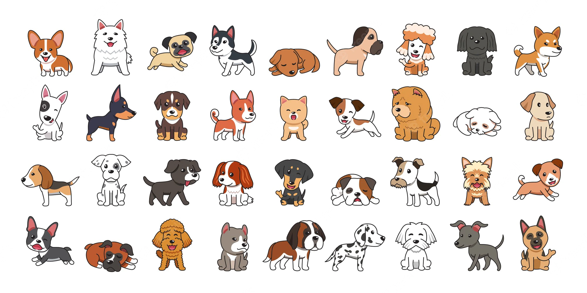
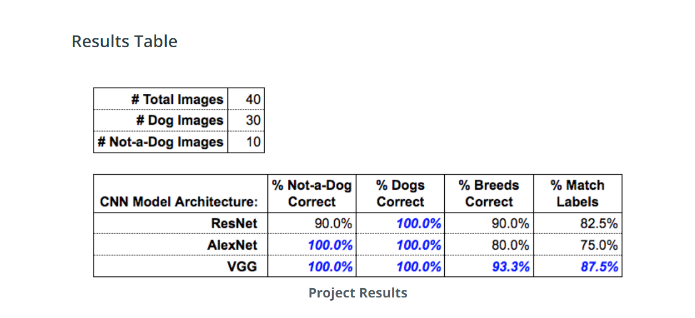

# Pre-trained-Image-Classifier-to-Identify-Dog-Breeds 🐶  

## Objectif 

- Improving  programming skills using Python.

- Identifying which pet images are of dogs and which pet images aren't of dogs.

- Classifying the breeds of dogs, for the images that are of dogs.

### To succeed the project, our results must be the same as the Project results from [Udacity](https://learn.udacity.com/) show below

Given our results, the `best` model architecture is `VGG`. It outperformed both of the other architectures when considering both objectives 1 and 2. You will notice that `ResNet` did classify dog breeds better than `AlexNet`, but only `VGG` and `AlexNet` were able to classify `dogs` and `not-a-dog` at $100$% accuracy. The model `VGG` was the one that was able to classify `dogs` and `not-a-dog` with $100$% accuracy and had the best performance regarding breed classification with $93.3$% accuracy.

## My Results 

- [`VGG`](Udacity-Project1/vgg_pet-images.txt)

- [`AlexNet`](Udacity-Project1/alexnet_pet-images.txt)

- [`ResNet`](Udacity-Project1/resnet_pet-images.txt)
